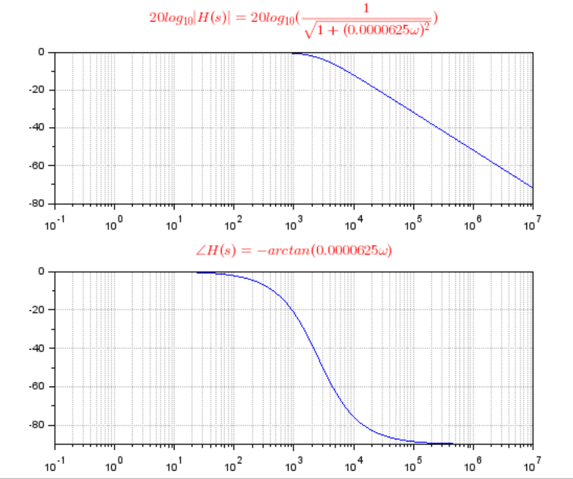

### 传递函数的幅频和相频特性的计算公式

#### 1. 计算公式

例如，有如下传递函数：
$$
H(s)=\frac {a+sb} {c+sd}=\frac {a+j\omega b}{c+j\omega d}
$$
那么：

- 幅频特性计算公式为：

$$
|H(s)|=\sqrt{\frac{a^2+(\omega b)^2}{c^2+(\omega d)^2}}
$$

- 相频特性计算公式为：

$$
\angle H(s)=arctan(\frac {\omega b} {a}) - arctan(\frac {\omega d} {c})
$$


#### 2. 示例

例如，有如下 **LR电路：**


其传递函数为：
$$
H(s)=\frac{1}{1+s \frac {L} {R}}=\frac{1}{1+0.0000625s} \tag{1}
$$
 那么：

- 幅值特性计算公式：

$$
|H(s)|=\frac{1}{\sqrt{1+(\frac{\omega L}{R})^2}} = \frac {1} {\sqrt{1+(0.0000625 \omega)^2}} \tag{2}
$$

- 相频特性计算公式：

$$
\angle H(s)=0-arctan(\frac{\omega L}{R}) = -arctan(0.0000625 \omega) \tag{3}
$$

##### 2.1 使用 Scilab 画出公式（1）、（2）、（3）

画出公式（1）的 Bode 图，在Scilab中输入：

```
s=%s;
H=1/(1+0.0000625*s);
Hs=syslin('c',H);
scf();bode(Hs,0.1,10^7,"$\frac{1}{1+0.0000625s}$");
```


分别画出公式（2）、（3）的幅频特性和相频特性曲线图，在Scilab中输入：

```
gda().grid=[1 1]*color("grey70");
title(gda(), "fontsize", 3, "color", "red", "fontname", "helvetica bold");

f=logspace(-1,7,73);
GHs=20*log10((sqrt(1+(0.0000625*2*%pi*f)^2))^-1);
GHs=20*log(1)-20*log10(sqrt(1+(0.0000625*2*%pi*f)^2));
scf();clf;
subplot(2,1,1);plot("l",f,GHs);title("$20log_{10}|H(s)|=20log_{10}(\frac {1} {\sqrt{1+(0.0000625 \omega)^2}})$");gca().sub_ticks(1) = 8;

PhiHs=-(180/%pi)*atan(2*%pi*f*0.0000625);
subplot(2,1,2);plot("l",f,PhiHs);title("$\angle H(s)=-arctan(0.0000625 \omega)$");gca().sub_ticks(1) = 8;

sda();
```

